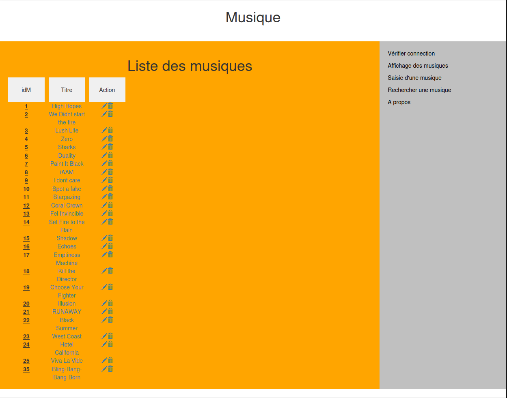
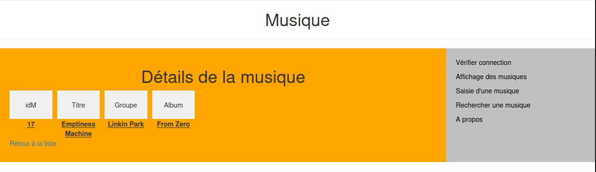
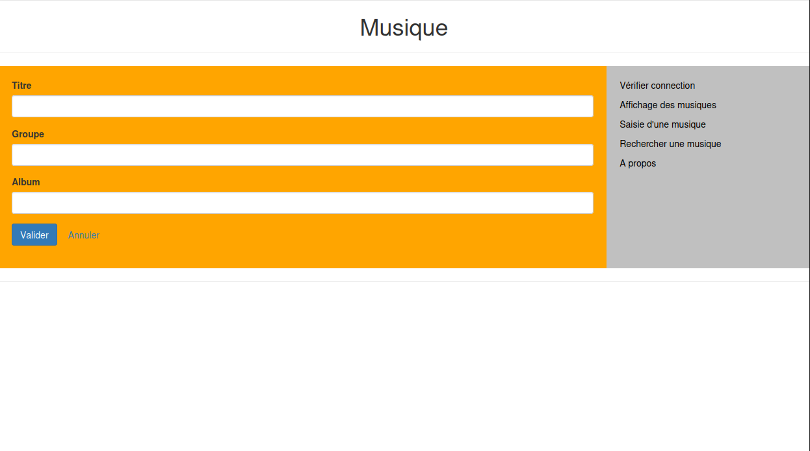
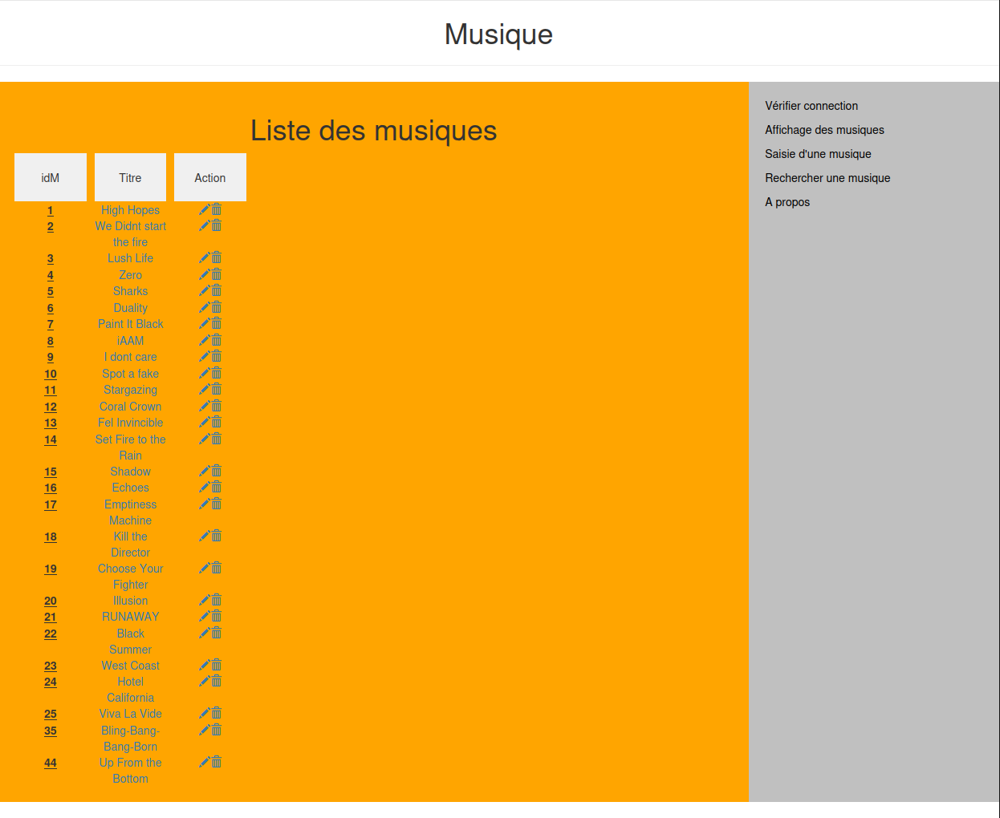

# Web-Music

Application web connectée à une **base de données** permettant l’ajout de **musiques** avec leur titre, groupe et album, ainsi que la **visualisation via une interface web**.

Projet fil rouge réalisé dans un cadre universitaire.

L’application n’est pas déployée publiquement, mais l’ensemble du code est disponible dans ce dépôt.

---

## Objectifs du projet

- Construction incrémentale d'un site web conformément à l'architecture MVCR présentée en cours
- Mise en place d'une base de données pour stocker les musiques
- Mise en place d'une application web dynamique
- Appliquer les principes de base du développement web côté serveur
- Mettre en place une architecture robuste aux attaques XSS

---

## Fonctionnalités

- Ajout de musiques via une interface web
- Stockage des données dans une base SQL
- Visualisation de la liste des musiques
- Mise à jour et suppression des entrées musicales
- Gestion des échanges entre le serveur et la base de données

---

## Technologies utilisées

- PHP
- SQL
- HTML / CSS
- Serveur web (environnement universitaire)

---

## Base de données

Le projet repose sur une base de données relationnelle permettant :
- l’enregistrement des musiques (titre, groupe, album),
- la récupération et l’affichage des données dans l’application web,
- la persistance des informations.

---

## Captures d’écran

## Accueil

### Liste

### Ajout de musique

Auteurs :   
TELLIER Basile
